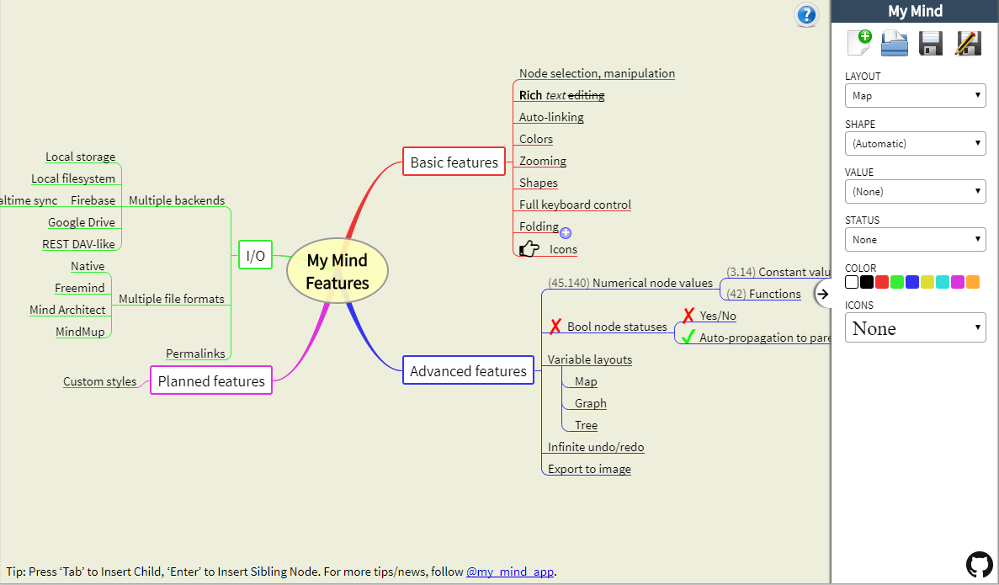

<!--
N.B.: This README was automatically generated by https://github.com/YunoHost/apps/tree/master/tools/README-generator
It shall NOT be edited by hand.
-->

# My Mind pour YunoHost

[](https://dash.yunohost.org/appci/app/my-mind)    
[](https://install-app.yunohost.org/?app=my-mind)

*[Read this readme in english.](./README.md)*

> *Ce package vous permet d'installer My Mind rapidement et simplement sur un serveur YunoHost.
Si vous n'avez pas YunoHost, regardez [ici](https://yunohost.org/#/install) pour savoir comment l'installer et en profiter.*

## Vue d'ensemble

My Mind is a web application for creating and managing Mind maps. It is free to use and you can fork its source code.

**Version incluse :** 2.0~ynh2

**Démo :** http://my-mind.github.io/?map=examples/features.mymind

## Captures d'écran



## Documentations et ressources

* Site officiel de l'app : <https://github.com/ondras/my-mind>
* Documentation officielle de l'admin : <https://github.com/ondras/my-mind/wiki>
* Dépôt de code officiel de l'app : <https://github.com/ondras/my-mind>
* Documentation YunoHost pour cette app : <https://yunohost.org/app_my-mind>
* Signaler un bug : <https://github.com/YunoHost-Apps/my-mind_ynh/issues>

## Informations pour les développeurs

Merci de faire vos pull request sur la [branche testing](https://github.com/YunoHost-Apps/my-mind_ynh/tree/testing).

Pour essayer la branche testing, procédez comme suit.

``` bash
sudo yunohost app install https://github.com/YunoHost-Apps/my-mind_ynh/tree/testing --debug
ou
sudo yunohost app upgrade my-mind -u https://github.com/YunoHost-Apps/my-mind_ynh/tree/testing --debug
```

**Plus d'infos sur le packaging d'applications :** <https://yunohost.org/packaging_apps>
